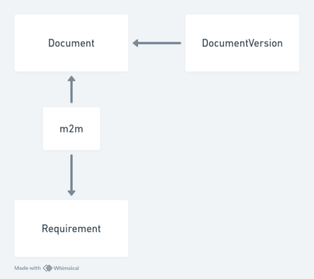

# Beavr test

## Requirements

- node >= 18
- pnpm >= 8
- docker >= 24

## How to run?

Launch the following commands:

```bash
# Install dependencies
pnpm i

# Create .env file
cp packages/api/.env.development packages/api/.env

# Run docker compose
docker compose up -d

# Run migrations
pnpm migrate

# Launch the development servers
pnpm dev
```

Then visit [http://localhost:5173/](http://localhost:5173/) in your browser.

## Database schema


